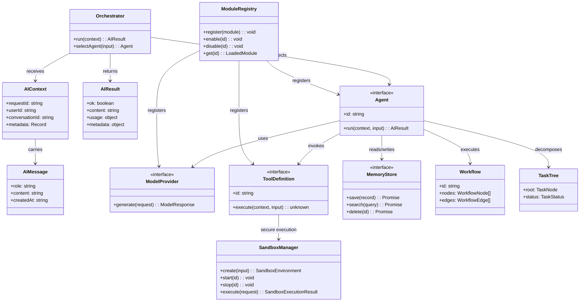

# UML Class Architecture

```mermaid
classDiagram
    class AIContext {
      +requestId: string
      +userId: string
      +conversationId: string
      +metadata: Record
    }

    class AIMessage {
      +role: string
      +content: string
      +createdAt: string
    }

    class AIResult {
      +ok: boolean
      +content: string
      +usage: object
      +metadata: object
    }

    class Agent {
      <<interface>>
      +id: string
      +run(context, input): AIResult
    }

    class ModelProvider {
      <<interface>>
      +generate(request): ModelResponse
    }

    class ToolDefinition {
      <<interface>>
      +id: string
      +execute(context, input): unknown
    }

    class MemoryStore {
      <<interface>>
      +save(record): Promise
      +search(query): Promise
      +delete(id): Promise
    }

    class Workflow {
      +id: string
      +nodes: WorkflowNode[]
      +edges: WorkflowEdge[]
    }

    class TaskTree {
      +root: TaskNode
      +status: TaskStatus
    }

    class SandboxManager {
      +create(input): SandboxEnvironment
      +start(id): void
      +stop(id): void
      +execute(request): SandboxExecutionResult
    }

    class ModuleRegistry {
      +register(module): void
      +enable(id): void
      +disable(id): void
      +get(id): LoadedModule
    }

    class Orchestrator {
      +run(context): AIResult
      +selectAgent(input): Agent
    }

    AIContext --> AIMessage : carries
    Agent --> ModelProvider : uses
    Agent --> ToolDefinition : invokes
    Agent --> MemoryStore : reads/writes
    Agent --> Workflow : executes
    Agent --> TaskTree : decomposes
    ToolDefinition --> SandboxManager : secure execution
    Orchestrator --> Agent : selects
    ModuleRegistry --> Agent : registers
    ModuleRegistry --> ModelProvider : registers
    ModuleRegistry --> ToolDefinition : registers
    Orchestrator --> AIContext : receives
    Orchestrator --> AIResult : returns
```

The interfaces are intentionally provider-neutral. Concrete providers, tools, agents, and isolation drivers can be replaced without changing the orchestration contract.
